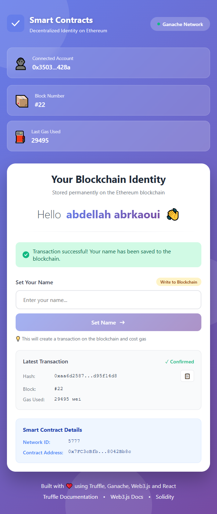

# 🌐 Hello World DApp - Decentralized Identity on Ethereum

A full-stack decentralized application (DApp) built with **Solidity**, **Truffle**, **Ganache**, **Web3.js**, and **React**. This project demonstrates how to create, deploy, and interact with smart contracts on a local Ethereum blockchain.


---

## 📋 Table of Contents

- [Overview](#overview)
- [Features](#features)
- [Tech Stack](#tech-stack)
- [Screenshots](#screenshots)
- [Project Structure](#project-structure)
- [Prerequisites](#prerequisites)
- [Installation](#installation)
- [Usage](#usage)
- [Smart Contract](#smart-contract)
- [How It Works](#how-it-works)
- [Contributing](#contributing)
- [License](#license)

---

## 🎯 Overview

This project is a simple yet powerful demonstration of blockchain technology. Users can store their name permanently on the Ethereum blockchain through a smart contract. The application features a beautiful, modern UI that interacts with the blockchain in real-time, showing transaction details, gas usage, and block information.

**Key Concept**: Unlike traditional databases, once data is written to the blockchain, it becomes immutable and transparent. This DApp showcases this fundamental blockchain principle through a user-friendly interface.

---

## ✨ Features

- 🔐 **Blockchain Identity Storage** - Store your name permanently on Ethereum
- 💼 **Real-time Blockchain Data** - Display current block number, account address, and gas usage
- 📊 **Transaction Tracking** - View transaction hash, block confirmation, and gas costs
- 🎨 **Modern UI/UX** - Beautiful gradient design with smooth animations
- ⚡ **Fast Development Environment** - Ganache local blockchain for instant transactions
- 🔄 **Live Updates** - Real-time contract state updates
- 📱 **Responsive Design** - Works on desktop, tablet, and mobile devices
- ✅ **Transaction Notifications** - Success alerts with auto-dismiss

---

## 🛠️ Tech Stack

### Blockchain

- **Solidity ^0.8.0** - Smart contract programming language
- **Truffle** - Development framework for Ethereum
- **Ganache** - Personal blockchain for Ethereum development
- **Web3.js** - JavaScript library for Ethereum interaction

### Frontend

- **React.js** - UI library for building user interfaces
- **CSS3** - Modern styling with animations and gradients

### Tools

- **Node.js** - JavaScript runtime
- **npm** - Package manager

---

## 📸 Screenshots

### Frontend - DApp Interface


_Modern, responsive interface showing blockchain identity storage with real-time transaction details_

### Ganache - Local Blockchain


_Ganache personal blockchain showing blocks, transactions, and account balances_

---

## 📁 Project Structure

```
blockchain-dapp/
├── contracts/                  # Solidity smart contracts
│   ├── HelloWorld.sol         # Main contract
│   └── Migrations.sol         # Truffle migrations contract
├── migrations/                 # Deployment scripts
│   └── 2_deploy_contracts.js
├── test/                       # Smart contract tests
│   └── helloWorld.js
├── frontend/                   # React application
│   ├── public/
│   ├── src/
│   │   ├── contracts/         # Compiled contract ABIs
│   │   ├── ContractInteraction.js
│   │   ├── ContractInteraction.css
│   │   ├── App.js
│   │   └── index.js
│   └── package.json
├── truffle-config.js          # Truffle configuration
└── README.md
```

---

## ✅ Prerequisites

Before you begin, ensure you have the following installed:

- **Node.js** (v14 or higher) - [Download](https://nodejs.org/)
- **npm** or **yarn** - Comes with Node.js
- **Truffle** - `npm install -g truffle`
- **Ganache** - [Download](https://archive.trufflesuite.com/ganache/)

---

## 🚀 Installation

### 1. Clone the Repository

```bash
git clone https://github.com/Abdellah-Abrkaoui/smartContracts-Blockhain.git
cd smartContracts-Blockhain
```

### 2. Install Truffle Dependencies

```bash
npm install
```

### 3. Start Ganache

- Open Ganache application
- Click "Quickstart" to create a local blockchain
- Ganache will run on `http://127.0.0.1:7545`

### 4. Compile Smart Contracts

```bash
truffle compile
```

### 5. Deploy to Ganache

```bash
truffle migrate
```

### 6. Run Tests (Optional)

```bash
truffle test
```

### 7. Install Frontend Dependencies

```bash
cd frontend
npm install
```

### 8. Start React App

```bash
npm start
```

The application will open at `http://localhost:3000`

---

## 💻 Usage

### Setting Your Name

1. **Connect to Blockchain**: The app automatically connects to Ganache
2. **Enter Your Name**: Type your name in the input field
3. **Submit Transaction**: Click "Set Name" button
4. **Wait for Confirmation**: Transaction will be processed (usually instant on Ganache)
5. **View Result**: Your name will be displayed and stored permanently on the blockchain

### Understanding the Interface

- **Connected Account**: Shows your Ethereum wallet address
- **Block Number**: Current blockchain block height
- **Last Gas Used**: Gas consumed by your last transaction
- **Transaction Details**: Hash, block, and gas information
- **Contract Details**: Network ID and contract address

**Built with ❤️ using Truffle, Ganache, Web3.js, and React**
